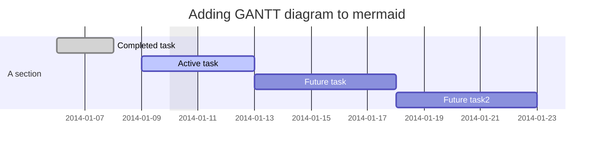
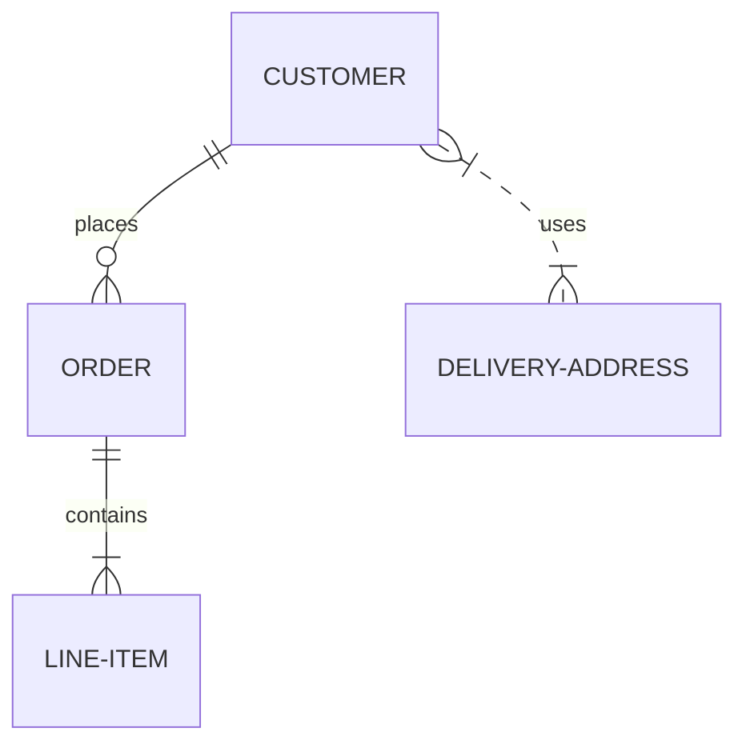
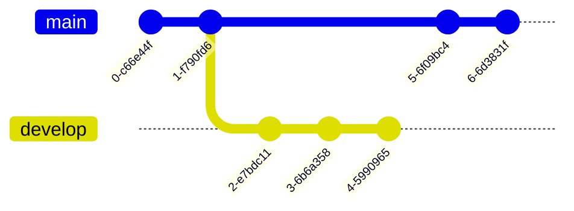
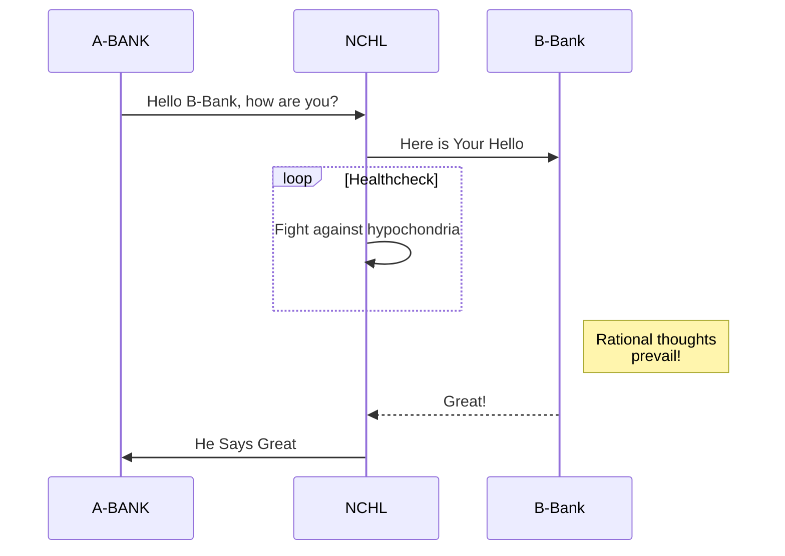

# Tutorial Customer

## Tutorial Customer Small Heading


---
description: This description will override the default.
---

# Title

Main content... May contain some [links](./file.mdx) or **emphasis**.


import Hello from '@site/src/pages/helloReact';

Release a version 1.0 of your project:


- asdasdasd
- asdjkasld

```json
{
    "hello": "world"
}

```
```jsx title="/src/components/HelloCodeTitle.js"
function HelloCodeTitle(props) {
  return <h1>Hello, {props.name}</h1>;
}
```
<Hello></Hello>

import Tabs from '@theme/Tabs';
import TabItem from '@theme/TabItem';

<Tabs className="unique-tabs">
  <TabItem value="apple" label="Apple" default>
    This is an apple 🍎
  </TabItem>
  <TabItem value="orange" label="Orange">
    This is an orange 🍊
  </TabItem>
  <TabItem value="banana" label="Banana">
    This is a banana 🍌
  </TabItem>
</Tabs>


:::note

Some **content** with _Markdown_ `syntax`. Check [this `api`](#).

:::

:::tip

Some **content** with _Markdown_ `syntax`. Check [this `api`](#).

:::

:::info

Some **content** with _Markdown_ `syntax`. Check [this `api`](#).

:::

:::caution

Some **content** with _Markdown_ `syntax`. Check [this `api`](#).

:::

:::danger

Some **content** with _Markdown_ `syntax`. Check [this `api`](#).

<Tabs>
  <TabItem value="apple" label="Apple">This is an apple 🍎</TabItem>
  <TabItem value="orange" label="Orange">This is an orange 🍊</TabItem>
  <TabItem value="banana" label="Banana">This is a banana 🍌</TabItem>
</Tabs>

:::

## Level 2 title

### Level 3 title

#### Level 4 title


<details style={{backgroundColor:'#e8f6f0', color: 'black'}}>
<summary> <b>  <span
    style={{
      backgroundColor: 'green',
      borderRadius: '2px',
      color: '#fff',
      padding: '0.2rem',
    }}>
    POST
  </span> </b> <b>   /v1/user/Save</b></summary>
<h2 id="#heading-id"><b>API To Save User</b></h2>

```jsx  showLineNumbers
export const Hello = () => {
  return (
    <Layout title="Hello" description="Hello React Page">
      <div
        style={{
          display: 'flex',
          justifyContent: 'center',
          alignItems: 'center',
          height: '50vh',
          fontSize: '20px',
        }}>
        <p>
          Edit <code>pages/helloReact.js</code> and save to reload.
        </p>
      </div>
    </Layout>
  );
}
```

</details>

## My Markdown page

<a target="\_blank" href='https://media.istockphoto.com/id/637696304/photo/patan.jpg?s=612x612&w=0&k=20&c=-53aSTGBGoOOqX5aoC3Hs1jhZ527v3Id_xOawHHVPpg='> Download this docx </a>











```jsx live
function Clock(props) {
  const [date, setDate] = useState(new Date());
  useEffect(() => {
    const timerID = setInterval(() => tick(), 1000);

    return function cleanup() {
      clearInterval(timerID);
    };
  });

  function tick() {
    setDate(new Date());
  }

  return (
    <div>
      <h2>It is {date.toLocaleTimeString()}.</h2>
    </div>
  );
}
```